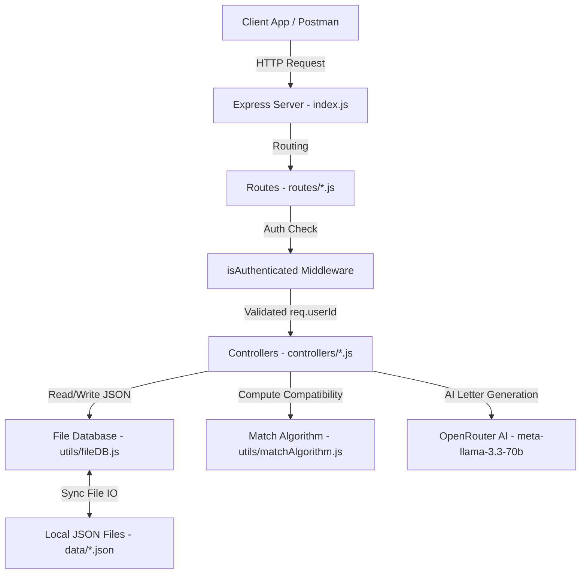

# TDC MatchMaker Backend API Documentation

Welcome to the **TDC MatchMaker Backend**. This is a Node.js and Express-based REST API that powers the matchmaking platform, allowing Matchmakers to manage client profiles, compute astrological and compatibility scores, record stage changes, post interactions, and generate AI-guided introduction letters.

---

## Table of Contents
1. [Architecture Overview](#architecture-overview)
2. [Project Setup & Configuration](#project-setup--configuration)
3. [Local File Databases (`/data`)](#local-file-databases-data)
4. [Authentication Middleware (`/middleware`)](#authentication-middleware-middleware)
5. [Utility Modules (`/utils`)](#utility-modules-utils)
6. [API Endpoints Reference](#api-endpoints-reference)
   - [Authentication Endpoints (`/api/v1/auth`)](#1-authentication-endpoints-apiv1auth)
   - [Client Management Endpoints (`/api/v1/clients`)](#2-client-management-endpoints-apiv1clients)
   - [Dashboard Endpoints (`/api/v1/dashboard`)](#3-dashboard-endpoints-apiv1dashboard)
   - [AI Service Endpoints (`/api/v1/ai`)](#4-ai-service-endpoints-apiv1ai)
   - [Match History Endpoints (`/api/v1/matches`)](#5-match-history-endpoints-apiv1matches)

---

## Architecture Overview

The application utilizes a classic controller-route-middleware pattern, reading and writing synchronously to local JSON files (acting as light mock databases).



---

## Project Setup & Configuration

### Environment Variables (`.env`)
Create a `.env` file in the root of the `backend/` folder:
```env
PORT=3000
SECRET_KEY=your_jwt_signing_key_here
OPENROUTER_API_KEY=your_openrouter_api_key_here
NODE_ENV=development
```

---

## Local File Databases (`/data`)

The database consists of four flat JSON files loaded via the `fileDB` utility:

### 1. `matchmaker.json`
Stores the registered matchmaker employee accounts.
* **Fields:** `id` (Number), `email` (String), `password` (String), `name` (String), `initials` (String), `designation` (String).

### 2. `clients.json`
Contains client records with detailed demographic, lifestyle, cultural, and professional attributes used in matching.
* **Key Fields:** 
  * Core identity: `id` (e.g. `TDC-1001`), `firstName`, `lastName`, `fullName`, `age`, `dateOfBirth`, `gender`, `maritalStatus`, `about`, `contact` (`email`, `phone`).
  * Compatibility traits: `religion`, `varna`, `jati`, `gotra`, `sect`, `motherTongue`, `languageFamily`, `fluentLanguages` (Array), `timelineToMarry`, `familyValues`, `livingArrangement`, `diet`, `drinking`, `smoking`, `heightCm`, `openToPets` (Boolean), `educationTier`, `isTopInstitution` (Boolean), `income`, `workPostMarriageIntent`, `city`, `metroRegion`, `state`, `zone`, `country`, `openToRelocation` (Boolean).
  * Astrological parameters: `horoscopeMatchingRequired` (Boolean), `isManglik` (Boolean).
  * System metadata: `platformMetadata` (`stage`, `stageBg`, `stageColor`, `addedDate`, `lastActivity`, `verified`, `assignedTo` {`id`, `name`}).

### 3. `notes.json`
Logs internal communications, updates, and chronological changes for specific clients.
* **Fields:** `id` (Timestamp), `clientId` (String), `type` (e.g., `"Stage Update"`, `"Call"`, `"Private Note"`), `content` (String), `isPrivate` (Boolean, optional), `oldStage` / `newStage` (String, optional, for stage changes), `createdAt` (ISO String), `matchmakerId` (Number).

### 4. `matches.json`
Maintains a log of matched proposal emails dispatched by matchmakers.
* **Fields:** `id` (Timestamp), `clientId` (String), `matchId` (String), `emailSubject` (String), `emailBody` (String), `status` (e.g., `"Sent"`), `sentAt` (ISO String), `matchmakerId` (Number).

---

## Authentication Middleware (`/middleware`)

### `isAuthenticated.js`
Secures endpoints by verifying cookie-based JSON Web Tokens (JWTs).
* **How it works:**
  1. Inspects request cookies for the `token` key.
  2. If missing, terminates with `401 User not authenticated`.
  3. Verifies the token using `process.env.SECRET_KEY`.
  4. If validation fails, terminates with `401 Invalid token`.
  5. If valid, binds the decoded token's `userId` to `req.userId` and calls `next()`.

---

## Utility Modules (`/utils`)

### 1. `fileDB.js`
A standard synchronous helper for JSON file handling.
* `read(path)`: Reads, parses, and returns the JSON payload from the file.
* `write(path, data)`: Stringifies the object (formatted with 2 spaces) and writes it back to disk.

### 2. `matchAlgorithm.js`
Features a highly tailored algorithmic engine that computes compatibility scores between a primary profile and potential candidates out of **100 points** across **19 weighted categories**.
* **Gender-Dependent Weights:** Categories are weighted differently depending on the gender of the profile (e.g., `income` is weighted `11` for females and `5` for males; `ageGap` is `9` for males and `4` for females). If the genders have mismatching weights, it averages the two scores.
* **19 Categories Evaluated:** Religion, Caste/Community, Mother Tongue, Family Planning (`wantKids`), Marriage Timeline, Family Values, Living Arrangement, Diet, Drinking, Smoking, Age Gap, Height, Education, Income, Career Expectations, Geographic Region, Relocation Flexibility, Manglik Status, and Horoscope Alignment.
* **Dealbreakers:** Triggers automatic dealbreakers (e.g. `kids_mismatch`, `religion_mismatch`, `living_arrangement_conflict`, `diet_conflict`, `manglik_conflict`) where matching expectations are fundamentally incompatible.
* **Reason Mapping:** Maps top matching criteria to standard user-friendly explanations.

### 3. `migrateData.js`
A migration script that reads raw client files, flattens deep nested objects (e.g. mapping `culturalBackground`, `familyDetails`, `lifestyleAndHabits` nested structures), normalizes strings into strict enums (zones, timeline formats, smoking/drinking, education tiers), and saves the results to `clients_modified.json` for database consistency.

---

## API Endpoints Reference

### 1. Authentication Endpoints (`/api/v1/auth`)

#### `POST /login`
Authenticates matchmakers and starts a session.
* **Method:** `POST`
* **Path:** `/api/v1/auth/login`
* **Authentication Required:** No
* **Headers:** `Content-Type: application/json`
* **Request Body:**
  ```json
  {
    "email": "admin1@test.com",
    "password": "testpassword1"
  }
  ```
* **Response:**
  * **Status:** `200 OK` (Sets an HTTP-only secure cookie named `token` containing the signed JWT).
  ```json
  {
    "success": true,
    "message": "Welcome back Taksh Diyora",
    "matchmaker": {
      "id": 1,
      "name": "Taksh Diyora",
      "designation": "Senior Matchmaker",
      "initials": "TD"
    }
  }
  ```
  * **Status:** `400 Bad Request` (Payload missing `email` or `password`).
  * **Status:** `401 Unauthorized` (Invalid email or password).

---

### 2. Client Management Endpoints (`/api/v1/clients`)

#### `POST /add`
Registers a new client under the currently logged-in matchmaker's roster.
* **Method:** `POST`
* **Path:** `/api/v1/clients/add`
* **Authentication Required:** Yes
* **Headers:** `Content-Type: application/json`
* **Request Body:**
  ```json
  {
    "firstName": "Aarav",
    "lastName": "Sharma",
    "age": 29,
    "dateOfBirth": "12 Jan 1997",
    "gender": "Male",
    "maritalStatus": "Never Married",
    "wantKids": "Yes",
    "about": "Tech enthusiast and avid reader.",
    "contact": {
      "email": "aarav.sharma@example.com",
      "phone": "+91 9876543201"
    },
    "religion": "Hindu",
    "varna": "Brahmin",
    "jati": "Saraswat",
    "motherTongue": "Hindi",
    "languageFamily": "Indo-Aryan",
    "timelineToMarry": "6-12 months",
    "familyValues": "Moderate",
    "livingArrangement": "Nuclear",
    "diet": "Pure Veg",
    "drinking": "Abstain",
    "smoking": "Non-smoker",
    "heightCm": "180",
    "educationTier": "Graduate",
    "income": "₹35 LPA",
    "workPostMarriageIntent": "Supports partner working",
    "city": "Delhi",
    "metroRegion": "Delhi",
    "state": "Delhi",
    "zone": "North",
    "country": "India"
  }
  ```
* **Response:**
  * **Status:** `201 Created`
  ```json
  {
    "success": true,
    "message": "Client added successfully",
    "client": { ...newClientObject }
  }
  ```
  * **Status:** `400 Bad Request` (Missing required parameters).
  * **Status:** `409 Conflict` (Client ID or email address already exists).

#### `GET /`
Retrieves clients assigned to the logged-in matchmaker, with query support for filters, sorting, and pagination.
* **Method:** `GET`
* **Path:** `/api/v1/clients`
* **Authentication Required:** Yes
* **Query Parameters (Optional):**
  * `search` (String): Case-insensitive match on client's `fullName`.
  * `stage` (String): Filter by current stage (e.g. `"Active Search"`, `"Matched"`).
  * `sortBy` (String): Options include `"lastActivity"`, `"age"`, `"name"`.
  * `page` (Number): Page number (defaults to `1`).
  * `limit` (Number): Roster objects per page (defaults to `12`).
* **Response:**
  * **Status:** `200 OK`
  ```json
  {
    "success": true,
    "totalClients": 15,
    "currentPage": 1,
    "totalPages": 2,
    "clients": [ ...clientProfiles ]
  }
  ```

#### `GET /:id`
Fetches a detailed profile of a single client.
* **Method:** `GET`
* **Path:** `/api/v1/clients/TDC-1001`
* **Authentication Required:** Yes
* **Response:**
  * **Status:** `200 OK`
  ```json
  {
    "success": true,
    "client": { ...clientProfile }
  }
  ```
  * **Status:** `404 Not Found` (Client ID does not exist).

#### `PATCH /:id/stage`
Updates the pipeline status of a client and logs the transition in the historical notes.
* **Method:** `PATCH`
* **Path:** `/api/v1/clients/TDC-1001/stage`
* **Authentication Required:** Yes
* **Request Body:**
  ```json
  {
    "stage": "Shortlisted",
    "reason": "Client expressed strong mutual compatibility with recent profile recommendations."
  }
  ```
* **Response:**
  * **Status:** `200 OK`
  ```json
  {
    "success": true,
    "oldStage": "Active Search",
    "updatedStage": "Shortlisted",
    "updatedAt": "2026-06-06T10:58:43.123Z",
    "reason": "Client expressed strong mutual compatibility..."
  }
  ```
  * **Status:** `400 Bad Request` (Missing `stage` in body).
  * **Status:** `404 Not Found` (Client ID does not exist).

#### `POST /:id/notes`
Appends a customized interaction note or comment to the client's file.
* **Method:** `POST`
* **Path:** `/api/v1/clients/TDC-1001/notes`
* **Authentication Required:** Yes
* **Request Body:**
  ```json
  {
    "type": "Call",
    "content": "Followed up regarding family preferences. Looking for nuclear living setups.",
    "isPrivate": true
  }
  ```
* **Response:**
  * **Status:** `201 Created`
  ```json
  {
    "success": true,
    "note": {
      "id": 1780670109505,
      "clientId": "TDC-1001",
      "type": "Call",
      "content": "Followed up...",
      "isPrivate": true,
      "createdAt": "2026-06-06T10:58:43.123Z",
      "matchmakerId": 1
    }
  }
  ```
  * **Status:** `400 Bad Request` (Missing `type` or `content`).
  * **Status:** `404 Not Found` (Client ID does not exist).

#### `GET /:id/notes`
Retrieves all note records linked to a client, sorted chronologically from newest to oldest.
* **Method:** `GET`
* **Path:** `/api/v1/clients/TDC-1001/notes`
* **Authentication Required:** Yes
* **Response:**
  * **Status:** `200 OK`
  ```json
  {
    "success": true,
    "count": 2,
    "notes": [ ...notesList ]
  }
  ```
  * **Status:** `404 Not Found` (Client ID does not exist).

#### `GET /:id/matches`
Computes matches for the client and returns the top 5 highest compatibility recommendations.
* **Method:** `GET`
* **Path:** `/api/v1/clients/TDC-1001/matches`
* **Authentication Required:** Yes
* **Behavior:** Automatically filters out candidates of the same gender and candidates who have already been sent a proposal (i.e., those logged in `matches.json` for this client).
* **Response:**
  * **Status:** `200 OK`
  ```json
  {
    "success": true,
    "count": 5,
    "primaryClient": {
      "id": "TDC-1001",
      "name": "Aarav Sharma",
      "gender": "Male"
    },
    "matches": [
      {
        "id": "TDC-1025",
        "fullName": "Sneha Iyer",
        ...candidateDetails,
        "matchScore": {
          "totalScore": 89.5,
          "scoreLabel": "Excellent",
          "hasDealbreaker": false,
          "dealbreakers": [],
          "breakdown": { ...fieldLevelMultipliersAndPoints }
        },
        "reasons": [
          "Both share similar religious values",
          "Shared language background",
          ...top5Reasons
        ]
      },
      ...
    ]
  }
  ```
  * **Status:** `404 Not Found` (Client ID does not exist).

#### `POST /:id/matches/:matchId/send`
Submits a match suggestion to the database logs and updates status to "Sent".
* **Method:** `POST`
* **Path:** `/api/v1/clients/TDC-1001/matches/TDC-1025/send`
* **Authentication Required:** Yes
* **Behavior:** Automatically transitions the client's pipeline stage to "In Conversation" (if currently in "Active Search" or "Shortlisted") and appends a corresponding Stage Update log to the client's notes.
* **Request Body:**
  ```json
  {
    "emailSubject": "Matrimonial Introduction - Sneha Iyer (TDC-1025)",
    "emailBody": "We are thrilled to suggest Sneha's profile based on mutual preferences."
  }
  ```
* **Response:**
  * **Status:** `200 OK`
  ```json
  {
    "success": true,
    "message": "Match sent successfully",
    "sentAt": "2026-06-06T10:58:43.123Z",
    "matchRecord": {
      "id": 1780670229381,
      "clientId": "TDC-1001",
      "matchId": "TDC-1025",
      "emailSubject": "Matrimonial Introduction...",
      "emailBody": "We are thrilled...",
      "status": "Sent",
      "sentAt": "2026-06-06T10:58:43.123Z",
      "matchmakerId": 1
    },
    "stageChanged": true,
    "newStage": "In Conversation"
  }
  ```
  * **Status:** `400 Bad Request` (Missing `emailSubject` or `emailBody`).
  * **Status:** `404 Not Found` (Primary client or suggested match ID not found in system).

---

### 3. Dashboard Endpoints (`/api/v1/dashboard`)

#### `GET /stats`
Aggregates statistics and metrics summarizing the roster.
* **Method:** `GET`
* **Path:** `/api/v1/dashboard/stats`
* **Authentication Required:** Yes
* **Response:**
  * **Status:** `200 OK`
  ```json
  {
    "success": true,
    "activeClients": 24,
    "matchesSentThisMonth": 0,
    "currentlyDating": 8,
    "closedMatched": 4
  }
  ```

---

### 4. AI Service Endpoints (`/api/v1/ai`)

#### `POST /generate-intro-email`
Utilizes OpenRouter LLM (`llama-3.3-70b-instruct`) to draft an introductory proposal email outlining compatibility reasons.
* **Method:** `POST`
* **Path:** `/api/v1/ai/generate-intro-email`
* **Authentication Required:** Yes
* **Request Body:**
  ```json
  {
    "client": {
      "fullName": "Aarav Sharma",
      "age": 29,
      "city": "Delhi",
      "designation": "Software Engineer"
    },
    "match": {
      "fullName": "Sneha Iyer",
      "age": 27,
      "city": "Mumbai",
      "designation": "Data Scientist",
      "religion": "Hindu",
      "degree": "MS in Data Science",
      "income": "₹28 LPA",
      "familyValues": "Moderate",
      "wantKids": "Yes"
    },
    "compatibilityScore": 89.5,
    "reasons": [
      "Both share similar religious values",
      "Shared language background",
      "Compatible lifestyle expectations"
    ]
  }
  ```
* **Response:**
  * **Status:** `200 OK`
  ```json
  {
    "success": true,
    "emailSubject": "Potential Match for Aarav Sharma",
    "emailBody": "Dear Aarav,\n\nI hope you are doing well. I would like to introduce you to Sneha Iyer, a potential match we've selected for you. Sneha is a 27-year-old Data Scientist based in Mumbai with an MS in Data Science and an income of ₹28 LPA. She shares your Hindu religion, moderate family values, and alignment on wanting kids.\n\nWe computed an excellent compatibility score of 89.5/100 for you two. This match was chosen because you both share similar religious values, a common language background, and highly compatible lifestyle expectations. I believe her background aligns well with your preferences.\n\nPlease let me know if you would be interested in learning more about Sneha's profile.\n\nWarm regards,\nYour Matchmaker"
  }
  ```
  * **Status:** `400 Bad Request` (Missing `client` or `match` details).
  * **Status:** `500 Internal Server Error` (AI request failed or API key mismatch).

---

### 5. Match History Endpoints (`/api/v1/matches`)

#### `GET /history`
Retrieves proposal history records for matches suggested specifically by the logged-in matchmaker, enriched with full profile details and compatibility scores.
* **Method:** `GET`
* **Path:** `/api/v1/matches/history`
* **Authentication Required:** Yes
* **Response:**
  * **Status:** `200 OK`
  ```json
  {
    "success": true,
    "count": 1,
    "history": [
      {
        "id": 1780659670929,
        "clientId": "TDC-1001",
        "matchId": "TDC-1025",
        "emailSubject": "Matrimonial Introduction - Sneha Iyer (TDC-1025)",
        "emailBody": "We are thrilled...",
        "status": "Sent",
        "sentAt": "2026-06-06T10:58:43.123Z",
        "matchmakerId": 1,
        "clientDetails": {
          "id": "TDC-1001",
          "firstName": "Aarav",
          "lastName": "Sharma",
          "fullName": "Aarav Sharma",
          "age": 29,
          ...clientDemographicDetails
        },
        "matchDetails": {
          "id": "TDC-1025",
          "firstName": "Sneha",
          "lastName": "Iyer",
          "fullName": "Sneha Iyer",
          "age": 27,
          ...matchDemographicDetails
        },
        "matchScore": {
          "totalScore": 89.5,
          "scoreLabel": "Excellent",
          "hasDealbreaker": false,
          "dealbreakers": [],
          "breakdown": { ...fieldLevelPoints }
        }
      }
    ]
  }
  ```
